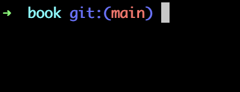

# Absolute Basics

The purpose of this section is to explain what developing software even means, how to use a shell, and the basics of a compiler (or interpreter). If you are an absolute beginner, read this chapter and then go learn a language. The rest of the book assumes you already know how to build software at a non junior level. 

## The Shell

Modern programming starts with the shell. It's been the beating heart of software development since the early seventies. The concept remains in modern operating systems. Windows and mac both natively support shell logins to remotely manage computers, as well as applications to emulate non login shells like the terminal app (or the older CMD host for windows).

For those on windows, to make stuff easier, download the newer terminal emulator at the windows store [here](https://apps.microsoft.com/detail/9n0dx20hk701?hl=en-US&gl=US). Those on mac can use the built-in terminal emulator or download iTerm2 [here](https://iterm2.com/downloads.html). When you open one of these applications you'll be presented with a text based interface. One of mine looks like this.



The white block there is a blinking cursor where I can type in commands. You can think of this window as a text based version of windows explorer or the mac finder. You always exist in the context of a folder. The default generally being your "home" directory (helpfully represented by the `~` symbol in the picture. You can change the directory using the `cd` (change directory) command. You can run a program in two ways. Either typing out the path to that program, or ensuring it's in a directory referenced in your PATH environment variable. The methods of doing so can vary greatly based on your setup.

In addition to simply running programs, you can also pass in arguments. You do this by typing the arguments after the name (or path) of the program before hitting the return key. Here's an example that will run the copy program to copy a file from one location to the other.

```bash
cp location_a location_b
```

I'm sure you can imagine that it would be relatively annoying dealing with remembering a bunch of commands and programs and how to run them without any sort of graphical experience. There are a few reasons (probably a lot more) as to why it's so common.

* CLI (command line interface) apps are crazy easy to make due to their simplicity. No need to require a browser or complicated to make desktop interfaces (we'll have a whole chapter later on talking about this problem).
* Because they are so simple, patterns have emerged. Standards have made using CLI apps generally consistent in how they're used.
* Because they don't require a desktop interface, they can be run headless.
  * They can be run remotely from another controlling device.
  * They can be run as children of other applications.

That last one is especially useful for developers, since the vast majority of programming applications have built-in terminal emulators. No need to create embedded user experiences for working with apps in an IDE if it supports CLI apps (though people still do, especially with a program called git).

**fun links**

* https://www.youtube.com/watch?v=tc4ROCJYbm0
  Old AT&T archive on the Unix operating system, which is the earliest example of several concepts we take for granted today.
* https://ohmyz.sh/
  A set of tools to make the terminal application zshell quite a bit more friendly. I use zshell and oh my zsh exclusively on mac and Linux operating systems.
* https://learn.microsoft.com/en-us/powershell/
  The new open source version of PowerShell. I use this for windows. You *can* use it for other operating systems but I've never heard of someone actually doing it.

## Compilers/Interpreters

Most modern code today is written in a plain text format with a syntax and grammar specific to the programming language. In order to turn your code into something runnable you need a compiler or interpreter specific to the language.

As far as the differences, interpreters are programs that consume code as input and execute the instructions given by the code without any intermediate steps. The most popular modern programming languages with interpreters are nodejs and python.

Compilers consume code as input and output either a complete self-contained program, or turn the code into an intermediate binary format to be run by something called a JIT compiler. Programming languages in the C family have two step compilation. The first step compiles individual files, and the second step links those files together to form a single program.

Languages like golang and rust compile into static programs, meaning they are self contained, and can be run as-is. This does however mean you need to compile the program individually for each operating system/CPU architecture combo you wish to support.

Dotnet and Java compile down to an IL (intermediate language), and use a JIT (just in time) compiler to convert the IL to runnable code. This has the benefit that you can do the main compilation once, and use an OS specific JIT to handle the specific of running on that platform. That does however require the JIT compiler be installed on the target environment in order to use the program.

**fun links**

* https://en.wikipedia.org/wiki/Compiler
  In case you've ever wanted way more info on compilers than you'll ever want or need. **Warning:** It's really not for beginners.

## What Is Software Development

This section will be fairly philosophical. Likely it won't be the only section like it, but I want to warn the reader nonetheless. Each person that performs a subjective labor like software development will develop their own philosophy regarding how it should be done. If you are a developer and don't agree with the contents of this section, that does not mean you are wrong. It simply means that your experiences are different than mine.

> Software development is the act of creating code with the purpose of converting that code into programs that provide automation or convenience. 

I generally like to add this statement after.

> Software should solve problems. Creating software without a problem leads to infinite scoped software that can do nothing more than soothe ego.

All software you build should have a problem it solves. While it's perfectly fine to build software for the singular purpose of learning, you should still align that learning to a potential problem with a specific scope. A common older problem that folks would use to learn new web technologies is creating a simple CMS (content management system) in that new technology. At some point in this book we'll be breaking down a CMS and why it's a relatively interesting problem for software design. 

